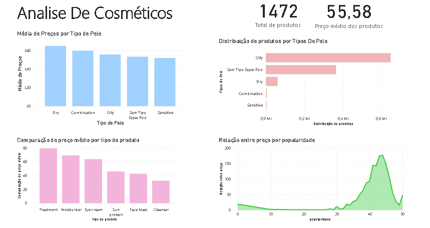
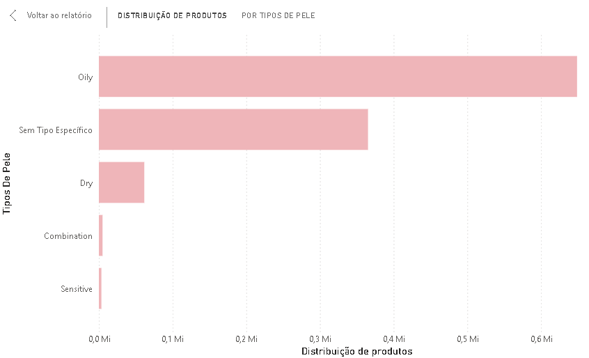

# Cosmetics Data Analysis

## 📌 Descrição do Projeto

Este projeto utiliza dados de cosméticos para realizar análises exploratórias, consultas SQL e visualizações gráficas. O objetivo principal é demonstrar habilidades em **SQL, Python e Power BI**, aplicando técnicas de análise de dados para extrair insights significativos sobre produtos de skincare.

## ⚙️ Funcionalidade do Projeto

✅ **Importação de dados CSV para o PostgreSQL**  
✅ **Criação e manipulação de tabelas no banco de dados**  
✅ **Execução de consultas SQL para análise:**  
  - Produtos mais baratos e mais caros  
  - Filtro por ingredientes específicos  
  - Contagem de produtos por marca e tipo de pele  
  - Cálculo de médias de avaliação (rank) por marca  
✅ **Análise exploratória de dados com Python**  
✅ **Desenvolvimento de dashboard interativo no Power BI**, incluindo:  
  - Indicadores principais (produto mais caro, produto mais popular, média de preços por marca)  
  - Gráficos de distribuição de produtos por tipo de pele  
  - Comparação de preços médios por categoria  
  - Identificação de produtos com ingredientes específicos  

## 🛠️ Tecnologias Usadas  

- **SQL (PostgreSQL):** Armazenamento e consultas de dados  
- **Python:** Limpeza e preparação de dados  
- **Power BI:** Visualização de dados e criação de dashboards  

## 📊 Dashboard e Gráficos  

Abaixo estão alguns prints do **dashboard no Power BI** e de gráficos específicos:  

📌 **Dashboard Completo:**  
  

📌 **Exemplo de Gráfico - Produtos por Tipo de Pele:**  
  

## 🚀 Status do Projeto  

O projeto está em desenvolvimento. As seguintes etapas foram concluídas:  

✅ Importação de dados para o PostgreSQL  
✅ Estruturação e organização das tabelas  
✅ Criação de diversas consultas SQL  
✅ Análise exploratória dos dados  
✅ Desenvolvimento inicial do **dashboard no Power BI**  

📌 **Próximos Passos:**  
🔹 Refinamento da análise exploratória de dados  
🔹 Melhorias no layout e interatividade do dashboard  
🔹 Documentação completa do pipeline  

## 👥 Colaboradores  

<table>
  <tr>
    <td align="center">
      <a href="http://github.com/dafnirca">
         
        
          <b>dafnirca</b>
        
      </a>
    </td>
  </tr>
</table>    

## 📎 Links Úteis  

🔗 [Repositório no GitHub](https://github.com/dafnirca/Cosmetics-Data-Analysis)  
📩 Contato: [LinkedIn](www.linkedin.com/in/dafni-rosa-76466a23a)  

---

### **📢 O que foi atualizado?**  
- Adicionada **seção do Dashboard no Power BI**  
- Incluídas **imagens de gráficos** 
- Atualizados **status do projeto** e **próximos passos**  
